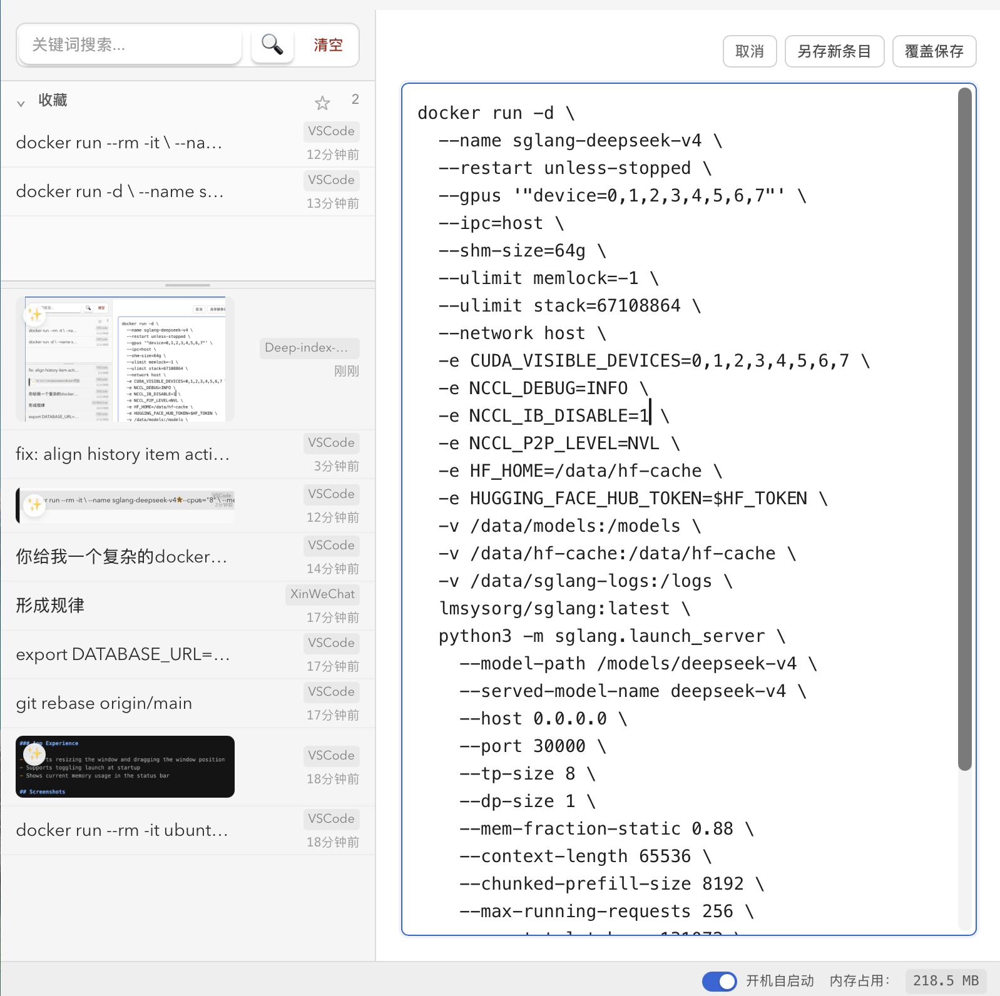

# Deep Index Board

English | [简体中文](README.zh-CN.md)

Clipboard history for people who tweak before they paste.

Deep Index Board is a desktop clipboard history app with an editable preview pane. It lets you find an old clipboard item, adjust text before pasting, save the edited version as a new item, or overwrite the original.

It also supports favorites, image preview, OCR, and semantic image search.

## Why

Most clipboard managers are optimized for retrieving exact past items. Deep Index Board is optimized for the moment after retrieval: when the content is almost right, but needs a small change before you paste it.

## Highlights

- Editable text preview: save edits as a new item or overwrite the current item
- Favorites section above history, with collapse, resize, and unfavorite-all actions
- Image preview, OCR, and semantic image search
- Per-item delete and clear-non-favorites workflows

## Features

### Clipboard History

- Automatically records copied text, images, files, and folders
- Opens the clipboard panel with a global shortcut, then pastes by clicking a history item
- Supports deleting individual history items
- Supports clearing non-favorited history items and removing images saved by the app

### Favorites

- Supports adding history items to favorites
- Keeps the favorites section fixed above the regular history list and collapsed by default
- Supports manually expanding/collapsing the favorites section and resizing it by dragging the divider
- Supports unfavoriting all items at once

### Search and Preview

- Supports keyword search across history
- Supports semantic search for images using natural-language descriptions
- Saves image content automatically and supports image preview
- Supports OCR text extraction for images and image files
- Shows content snapshots for text files

### Text Editing

- Text items can explicitly enter edit mode in the right-side preview pane
- Edited content must be manually saved as a new item or used to overwrite the current item
- Draft edits do not automatically modify the original history item

### App Experience

- Supports resizing the window and dragging the window position
- Supports toggling launch at startup
- Shows current memory usage in the status bar

## Screenshots

<p align="center">
  
</p>

## Usage

After launch, the app listens to clipboard changes in the background.

- Windows: press `Alt + V` to open the panel
- macOS: press `Control + V` to open the panel

In the panel, you can search, preview, favorite, edit, delete, and select clipboard history items. The top-level clear action removes non-favorited history items while keeping the favorites section intact.

## macOS Unsigned App Notes

This project is currently distributed as a plain `.app` bundle, not a signed and notarized installer. Only run it if you trust the source.

If macOS says the app is from an unidentified developer, first try:

1. Move `deep-index-board.app` to `/Applications`.
2. Right-click the app and choose `Open`.
3. If macOS shows an `Open Anyway` option in `System Settings` -> `Privacy & Security`, use it.

If macOS still reports that the app is damaged or cannot be opened, remove the quarantine attribute:

```bash
xattr -dr com.apple.quarantine /Applications/deep-index-board.app
```

If you keep the app somewhere else, replace the path with the actual `.app` path:

```bash
xattr -dr com.apple.quarantine "/path/to/deep-index-board.app"
```

The app also needs Accessibility permission for paste automation and focus-related behavior. Enable it in `System Settings` -> `Privacy & Security` -> `Accessibility`. If paste does not work after granting permission, remove the app from the Accessibility list, add it again, and restart the app.

## License

MIT License. You may use, modify, and distribute this project freely, as long as the copyright and license notice are preserved.
